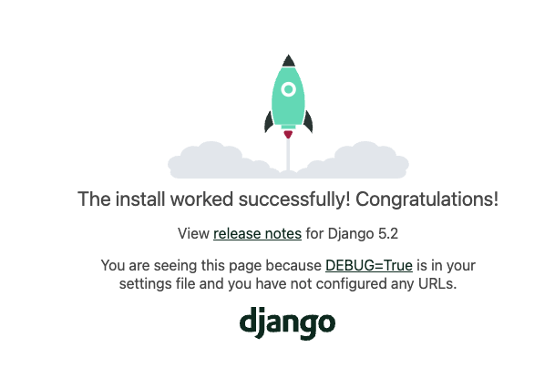

# 環境構築
## .envを作成し、以下を記載
- SECRET_KEYは自身で作成
[SECRET_KEY作成方法](https://www.cfxlog.com/django-secretkey/)
```
DATABASE_URL=postgres://postgres:postgres@db:5432/twitter_django_backend
SECRET_KEY=<自身で生成したものを使う>
DEBUG=1
```

## dockerを立ち上げる
```docker compose up```

ブラウザで [localhost:8000](http://localhost:8000) にアクセスし、以下の画面が表示されたら、環境構築完了。

